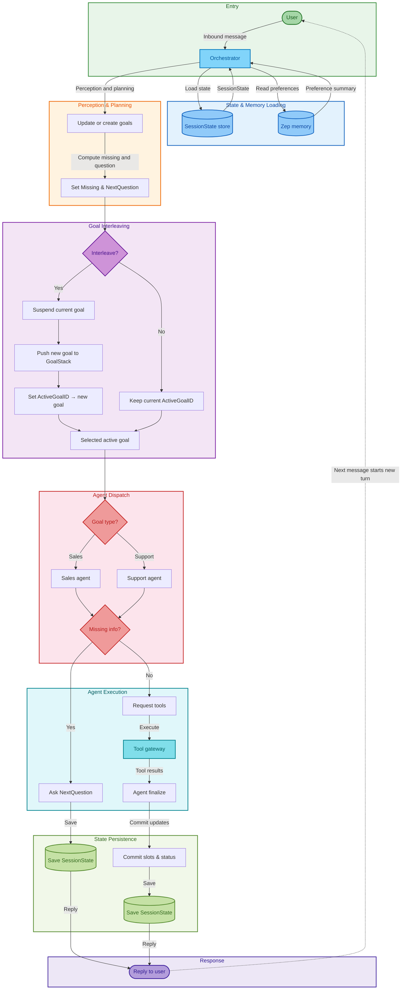

sequenceDiagram
    autonumber
    participant U as User
    participant O as Orchestrator Agent
    participant S as StateStore
    participant Z as Zep Memory
    participant SA as Sales Agent
    participant SU as Support Agent
    participant T as Tool Gateway

    U->>O: message(text)

    O->>S: Load(SessionState by session_id)
    S-->>O: SessionState(ActiveGoalID, GoalStack, Goals, Version)

    Note over O: Perception + Planning (update/create goals)\n- fill Slots\n- compute Missing + NextQuestion\n- set GoalStatus\n- decide interleave using Priority

    alt Interleave (new goal priority > current)
        Note over O: SuspendAndActivate(new_goal)\n- current goal -> suspended\n- GoalStack push\n- ActiveGoalID = new_goal
    else No interleave
        Note over O: Keep/Set ActiveGoalID
    end

    %% Zep is always used (not optional)
    O->>Z: ReadMemory(customer_id)
    Z-->>O: memory_summary

    alt Active goal is sales.*
        O->>SA: AgentRun(active_goal, memory_summary, tool_results=[])
        alt Goal blocked (Missing not empty)
            SA-->>O: {message=NextQuestion, tool_requests=[]}
        else Goal active
            SA-->>O: {tool_requests=[...], message=""}
            O->>T: ExecuteTools(agent_type="sales", tool_requests)
            T-->>O: tool_results
            O->>SA: AgentRun(active_goal, memory_summary, tool_results)
            SA-->>O: {message=final_answer, state_updates}
        end
    else Active goal is support.*
        O->>SU: AgentRun(active_goal, memory_summary, tool_results=[])
        alt Goal blocked (Missing not empty)
            SU-->>O: {message=NextQuestion, tool_requests=[]}
        else Goal active
            SU-->>O: {tool_requests=[...], message=""}
            O->>T: ExecuteTools(agent_type="support", tool_requests)
            T-->>O: tool_results
            O->>SU: AgentRun(active_goal, memory_summary, tool_results)
            SU-->>O: {message=final_answer, state_updates}
        end
    end

    Note over O: Commit state (Layer 4)\n- merge slots_patch\n- apply set_status\n- if active goal done: MarkGoalDone() -> ResumePrevious()\n- Version++ UpdatedAt

    O->>S: Save(SessionState)
    S-->>O: OK

    %% Zep write-back is always used (not optional)
    O->>Z: WriteMemory(customer_id, summary_update)
    Z-->>O: OK

    O-->>U: reply(message)

