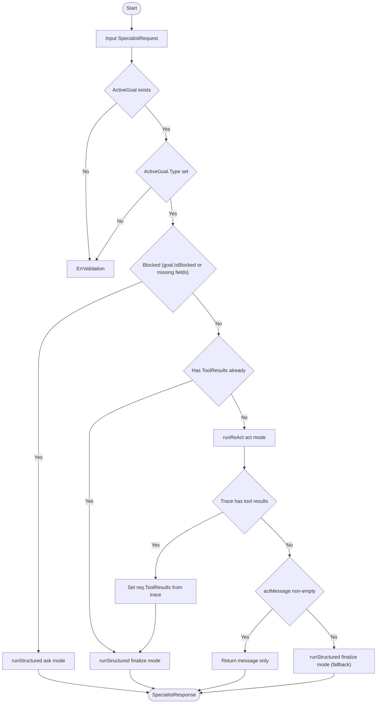
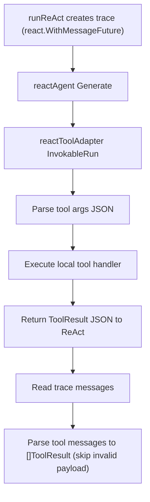

# Specialist Internal Flow

## ReAct Tool Execution Subflow

## Notes

- Specialist still owns tool execution in this phase (tools run inside ReAct via `reactToolAdapter`).
- Orchestrator contract remains unchanged: it still calls `specialist.Run(...)` once per turn.
